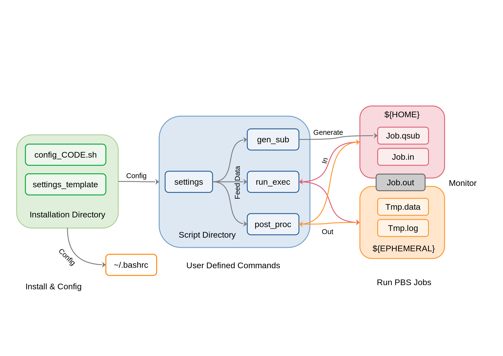

# General job submitter for Imperial CX1

A general job submitter for parallel programs on [Imperial CX1](https://www.imperial.ac.uk/admin-services/ict/self-service/research-support/rcs/), PBS job scheduler. Based on Linux Bash Shell.

[toc]

## Structure of the repository

Scripts in the main folder, i.e., `gen_sub`, `settings_template`, `run_exec`, and `post_proc` are shared scripts for job submission and post processing, which will be configured and placed in the directory specified during installation. `settings_template` will be named as `settings` after being configured.

* `gen_sub` - Process the options specified in command line, execute necessary checks (file existence, walltime and node format), and generate the '.qsub' file.  
* `run_exec` - Process the options for parallel programs, move and rename input files from the home directory to the ephemeral directory, sync nodes, execute the mpi command to launch parallel jobs.  
* `post_proc` - Save output files from the ephemeral directory to the home directory and remove the ephemeral directory to save disk space.  
* `settings_template` - An empty list of keywords, which sets values of program-dependent parameters. It will be referred by other scripts after being initialized.

In the sub-folders with specific names of simulation codes, there are configuration files named as `config_CODE.sh`, which is the script for installation. The `settings_example_CODE` gives a example of setups.

The structure of this general job submitter is illustrated in the figure below:



## Install

1. Use `scp` to upload 4 general scripts and a specific configuration script `config_CODE.sh` to `${HOME}` on the cluster.  
2. Execute the script: `bash config_CODE.sh`.  
3. Following the instructions, specify the directory of the job submitter and the directory of executables, or module loading command.  
4. Type `source ~/.bashrc` to implement user-defined commands. 

**Note**

1. All the scripts should be placed in the same directory.  
2. By default, job submitter scripts will be stored in `${HOME}/runCODE/`.  

## General instructions

This job submitter is useful for jobs launched by a constant parallel executable, i.e., multiple jobs with the same command is supported, but any job involving multiple commands is not. Besides, it is only useful for jobs launched by a 'main' input file. Other file inputs is allowed either as mandatory or optional files, but only one file can be used to define an `-in` flag (see below).

### User defined commands

### Command line flags

The script adopts the command-line options to launch jobs. The general flags include:

| FLAG | FORMAT | DEFINITION                                                               |
|:-----|:------:| :------------------------------------------------------------------------|
| -in  | string | The main input file                                                      |
| -ref | string | Optional, the common basename of reference files                         |
| -nd  | int    | The number of nodes requested for the job                                |
| -wt  | hh:mm  | The walltime requested for the job                                       |
| --   | (NA)   | The separator, followed by other command line options for the executable |

### Multiple jobs

### Keyword list

Keywords used for `settings_template` are listed in the table below. Modify the values in the same file to change the parameters used during computation.

| KEYWORD                 | DEFAULT VALUE   | DEFINITION |
|:------------------------|:---------------:|:-----------|
| SUBMISSION_EXT          | .qsub           | The extension of job submission script |
| NCPU_PER_NODE           | 24              | Number of processors per node |
| MEM_PER_NODE            | 50              | Unit: GB. Requested memory per node |
| N_THREAD                | 1               | The default number of threading |
| NGPU_PER_NODE           | 0               | Number of GPUs per node |
| GPU_TYPE                | RTX6000         | The default type of GPU |
| BUDGET_CODE             | -               | For ARCHER2. Budget code of a research project |
| QOS                     | -               | For ARCHER2. Quality of service |
| PARTITION               | -               | For ARCHER2. Partition of jobs |
| TIME_OUT                | 3               | Unit: min. Time spared for post processing |
| JOB_TMPDIR              | ${EPHEMERAL}    | The temporary directory for calculations |
| EXEDIR                  | \[depends\]     | Directory of executable / Available module load command |
| EXE_PARALLEL            | \[depends\]     | The parallel executable |
| EXE_OPTIONS             | \[depends\]     | Default command line options for the executable specified |
| PRE_CALC                | \[Table\]       | Saved names, temporary names, and definitions of mandatory input files |
| FILE_EXT                | \[Table\]       | Saved names, temporary names, and definitions of optional input files |
| POST_CALC               | \[Table\]       | Saved names, temporary names, and definitions of output files |
| JOB_SUBMISSION_TEMPLATE | \[script\]      | Template for job submission scripts |

**NOTE**

1. Keyword 'JOB_SUBMISSION_TEMPLATE' should be the last keyword, but the sequences of other keywords are allowed to change.  
2. Empty lines between keywords and their values are forbidden.  
3. All listed keywords have been included in the scripts. Undefined keywords are left blank.  
4. Multiple-line input for keywords other than 'PRE_CALC', 'FILE_EXT', 'POST_CALC' and 'JOB_SUBMISSION_TEMPLATE' is forbidden, otherwise the code will only read the top line.  
5. Requesting any GPU will lead the job to the queue for GPU node. For CPU only jobs, 'NGPU' should always be 0, in which case 'GPU_TYPE' will never be visited.  
6. By default, 'JOB_TMPDIR' is set as `${EPHEMERAL}`. The folder for the current job is named as '\[jobname\]\_\[jobID\]'.  
7. Dashed lines and titles for 'PRE_CALC', 'POST_CALC', and 'JOB_SUBMISSION_TEMPLATE' are used as separators and are not allowed to be removed.  
8. The qsub template attached during initialization is only compatible with the default settings. For user-defined executables / commands, changes might be made accordingly in the 'JOB_SUBMISSION_TEMPLATE' block (see the LAMMPS test case).

### 'PRE_CALC', 'FILE_EXT' and 'POST_CALC' tables

These 3 keywords require 3 separate tables of mandatory input files, optional input files and output files. 'SAVED' specifies the desired name in `${HOME}` directory, while 'TEMPORARY' specifies the desired name in `${EPHEMERAL}` directory. 'DEFINITION' will not be scanned, which is used as a comment / reminder.

In practice, `run_exec` and `post_proc` scan all the formats listed and moves all the matching files forward and backward. Missing any file in 'PRE_CALC' table immediately leads to the interruption of calculation, while missing files listed in 'FILE_EXT' does not stop the job. The result of every scan is printed in '.o\[jobid\]' file. 

The naming scheme of input files are recommended to follow certain rules. Meanwhile, to ensure the generality, some extra rules have to be set for codes extremely flexible to input formats when performing simulations (usually MD codes, especially LAMMPS, which might be a tradition different from the DFT community). To achieve this, a 'pseudo' regular expression is used. Keywords are listed below:

`[jobname]` - The variable of the main input file basename. No '.' is allowed for `[jobname]`, i.e., all the characters after the first full stop are recognized as extensions.  
`[pre_job]` - The variable of the reference file basename. No '.' is allowed. All the reference files should be placed in the same directory, even not in any sub-directory, and have the same basename, `[pre_job]`.  

**Keywords below are allowed in 'POST_CALC' only**

`/` - At the end of a string. It indicates that the string should be recognized as a folder, rather than a file.  
`*` - In the 'TEMPORARY' column, it has the same meaning as '\*' in bash shell - any string of any length. In the 'SAVED' column, it is only allowed to appear at the beginning of a string, which means saving the file in `${HOME}` as its temporary name.

### Normal termination vs Interruption

* If the job is terminated due to exceeding walltime, temporary files will be saved in the output directory. The temporary directory will be removed.

* If the job is terminated due to improper settings of calculation parameters, temporary files will be saved in the output directory. The temporary directory will be removed.

* If the job is killed before 'timeout' (usually by user), temporary will be saved in the temporary directory with temporary names. The temporary directory will not be removed. Refer to '.out' file or '.o\[jobid\]' file for the path. 

### General outputs

**\[jobname\].out**  
Output file in home directory, used to record information and monitor the progress of parallel jobs.

**\[jobname\].o\[jobid\]**  
A verbose version of .out file, for debugging. Besides the information of .out file, it includes the scripts , the list of files in the ephemeral directory, and the screen outputs of `run_exec` and `post_proc` scripts.

**\[jobname\].e\[jobid\]**   
For debugging. Records the screen outputs when PBS system executes the .qsub file (usually error messages).

## Program specific instructions

### [CRYSTAL](https://www.crystal.unito.it/index.php)

*Authors: Spica. Vir. & G. Mallia*

### [LAMMPS](https://www.lammps.org/)

*Author: Spica. Vir., Contributors: A. Arber & K. Tallat-Kelpsa*

### [GROMACS](https://www.gromacs.org/)

*Author: Spica. Vir., Contributor: K. Tallat-Kelpsa*

**Mandatory input**  
\[jobname\].tpr

**Defaults**  
EXEDIR - module load  gromacs/2021.3-mpi  
EXE_PARALLEL - gmx_mpi  
EXE_OPTIONS - mdrun -s

**Commands**  
`Pgmx` - Generate qsub files for GROMACS MD jobs.  
`setgmx` - Check the `settings` file of runGROMACS.

**Explanations of test cases**

The energy minimization steps in [Tutorial 1: Lysozyme in Water](http://www.mdtutorials.com/gmx/lysozyme/index.html) and [Tutorial 3: Umbrella Sampling](http://www.mdtutorials.com/gmx/umbrella/index.html) are used as testing cases. The interactive generation of '.tpr' file is obtained in serial on login nodes. Only 'mdrun' is allowed to run in parallel. To illustrate that the job submitter can combine different mpi jobs into the same qsub file, the following command is used:

``` console
~$ Pgmx -in em-1AKI.tpr -in em-2BEG.tpr -wt 00:20 -nd 1
~$ qsub em-1AKI-em-2BEG.qsub
```

### [GULP](http://gulp.curtin.edu.au/gulp/)

*Author: Spica. Vir.*